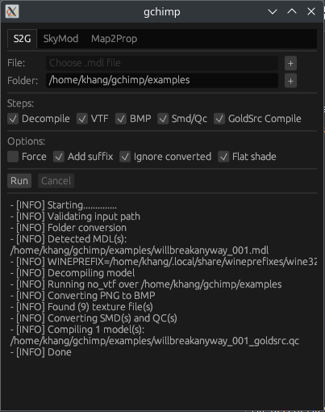

# gchimp

A collection of various GoldSrc mapping tools with both graphical and command line interface

## Installation

Head to [Release](https://github.com/khanghugo/gchimp/releases) page to download the app or latest [Actions](https://github.com/khanghugo/gchimp/actions) commits.

Usually it would just work out of the box. If there is any problem, try starting the binary through terminal and you will see the program output to better diagnose the issue.

## Features

- [S2G: Source to GoldSrc model converter](https://github.com/khanghugo/gchimp/wiki/S2G)

- [SkyMod: Creates skybox model out of images](https://github.com/khanghugo/gchimp/wiki/SkyMod)

- [TexTile: Tiles your texture and some more](https://github.com/khanghugo/gchimp/wiki/TexTile)

- [Command line interface: You can do this instead of GUI](https://github.com/khanghugo/gchimp/wiki/Command%E2%80%90line-interface)

- [Custom Scripting: Write your own functionality](https://github.com/khanghugo/gchimp/wiki/Custom-Scripting)

### Planned features

- [ ] A functional enough Wally to edit WAD files 
- [x] Texture filters such as tiling because tiling is nice to preserve overall detail for highly scaled texture
- [ ] [map2prop](https://erty-gamedev.github.io/Docs-Map2Prop/) clone that hopefully goes open source before the original project

## Building

After building the project, put `config.toml` from `dist` folder into the same folder as the binary `gchimp`

Then, download [no_vtf](https://sr.ht/~b5327157/no_vtf/) and put the `no_vtf` folder inside `dist`
