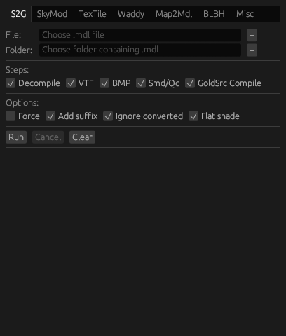

# gchimp

A collection of various GoldSrc mapping tools with both graphical and command line interface

**You can check gchimp-web, a mini version of native application at your convenience, here [http://gchimp.romanian-jumpers.com/](http://gchimp.romanian-jumpers.com/)**



## Installation

Head to [Release](https://github.com/khanghugo/gchimp/releases) page to download the app or latest [Actions](https://github.com/khanghugo/gchimp/actions) commits.

Usually it would just work out of the box. If there is any problem, try starting the binary through terminal and you will see the program output to better diagnose the issue.

## Features

- [S2G: Source to GoldSrc model converter](https://github.com/khanghugo/gchimp/wiki/S2G)

- [SkyMod: Creates skybox model out of images](https://github.com/khanghugo/gchimp/wiki/SkyMod)

- [TexTile: Tiles your texture and some more](https://github.com/khanghugo/gchimp/wiki/TexTile)

- [Waddy: A simple WAD editor](https://github.com/khanghugo/gchimp/wiki/Waddy)

- [Map2Mdl: Converts .map into .mdl with ease](https://github.com/khanghugo/gchimp/wiki/Map2Mdl)

- [Command line interface: Some other features that don't deserve GUI treatment (or do deserve CLI treatment)](https://github.com/khanghugo/gchimp/wiki/Command%E2%80%90line-interface)

- [Custom Scripting: Write your own functionality](https://github.com/khanghugo/gchimp/wiki/Custom-Scripting)

### Planned features

- [ ] Radiosity compiler. This will take a while.

## Building

To build native egui application, do

```sh
cargo build --package gchimp-native
```

To run native egui application, do

```sh
cargo run --release --package gchimp-native
```

## Deploying to the web

You can deploy gchimp to the web. The features are limited at the moment

Refer to [GCHIMP-WEB-README.md](./gchimp-web/www/README.md)
